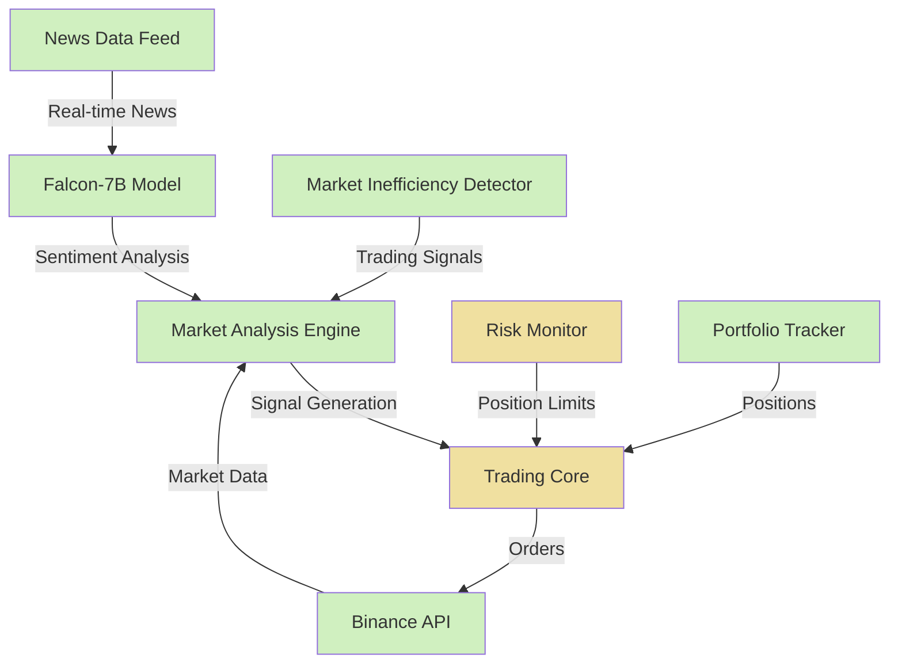

# FinGPT Trader

A quantitative trading system that combines Falcon-7B language model-driven sentiment analysis with technical market analysis to identify cryptocurrency trading opportunities. The system's core innovation is its confidence-weighted sentiment scoring mechanism, which integrates both the sentiment value and the model's confidence level to generate more reliable trading signals.

## System Overview

FinGPT Trader processes financial news and market data in parallel, combining both sources to identify potential trading opportunities. The system uses:

- **Falcon-7B Model**: Fine-tuned for financial sentiment analysis
- **Confidence-Weighted Scoring**: 60% confidence weight, 40% sentiment strength weight
- **Technical Analysis**: Standard technical indicators for market inefficiency detection
- **Event-Driven Architecture**: Asynchronous processing of market events
- **Risk Management**: Basic position tracking and exposure monitoring

## Current Implementation Status

✅ = Implemented | 🚧 = Partially Implemented | 📅 = Planned | ⚠️ = Implementation Issues

### Core Components

- **Sentiment Analysis**
  - ✅ Falcon-7B financial sentiment model implementation
  - ✅ Confidence-weighted sentiment scoring
  - ✅ Adaptive correlation tracking between sentiment and price

- **Market Data Processing**
  - 🚧 Price data collection from Binance (⚠️ API parameter issues)
  - ✅ Technical indicator calculation (RSI, MAs, volume analysis)
  - ✅ Market inefficiency detection
  - 🚧 Minimum order size handling (⚠️ Size calculations incorrect)

- **Trading Execution**
  - ✅ Binance testnet integration
  - 🚧 Order execution (⚠️ Method parameter mismatches)
  - ✅ Position tracking
  - 📅 Tax-loss harvesting

- **Risk Management**
  - 🚧 Basic position tracking
  - ✅ Simple exposure metrics
  - 📅 Value-at-Risk (VaR) calculations
  - 📅 Correlation-aware risk metrics

## Technical Implementation

### Confidence-Weighted Sentiment Analysis

The system's key innovation is its confidence-weighted sentiment scoring mechanism. Rather than using raw sentiment scores, FinGPT Trader weighs the model's confidence (60%) against sentiment strength (40%) to generate more reliable signals:

```python
# Calculate confidence-weighted sentiment score
weighted_score = (confidence * 0.6) * (abs(sentiment_score) * 0.4)

# Generate signal if weighted score exceeds detection threshold
if weighted_score > detection_threshold:
    signals.append({
        'symbol': pair,
        'type': 'SENTIMENT',
        'direction': 1 if sentiment_score > 0 else -1,
        'strength': abs(sentiment_score),
        'confidence': confidence,
        'price': current_price,
        'timestamp': datetime.now()
    })
```

This approach helps filter out low-confidence predictions, reducing false signals.

### Market-Sentiment Correlation Tracking

The system maintains a history of sentiment and price movements to calculate correlation coefficients:

```python
# Calculate correlation between sentiment changes and price changes
correlation = np.corrcoef(
    sentiment_changes[:min_length],
    price_changes[:min_length]
)[0, 1]

# Update correlation record for position sizing
self.market_correlation[symbol] = {
    'value': correlation,
    'updated_at': datetime.now(),
    'samples': min_length
}
```

This correlation data helps adjust signal strength based on historical sentiment-price relationships.

### System Architecture



## Configuration

The system uses a hierarchical YAML-based configuration system:
- `trading.yaml`: Core trading parameters, thresholds, and position sizing
- `strategies.yaml`: Strategy-specific parameters and detection thresholds
- `model.yaml`: ML model configurations
- `services.yaml`: External service connectivity parameters

## Setup Requirements

### Prerequisites
- Python 3.8+ with asyncio support
- Windows, macOS, or Linux 
- 8GB+ RAM recommended (for model loading)
- CUDA-compatible GPU recommended but not required

### Environment Setup
```bash
# Create virtual environment
python -m venv venv
source venv/bin/activate  # or activate on Windows

# Install dependencies
pip install -r requirements.txt

# Windows-specific: Set console to UTF-8 mode
chcp 65001  # If running in cmd.exe
```

### Configuration
```bash
# Set up your .env file with required API keys:
BINANCE_API_KEY=your_key_here         # Obtain from Binance Testnet
BINANCE_API_SECRET=your_secret_here   # Obtain from Binance Testnet
CRYPTOPANIC_API_KEY=your_key_here     # Required for news feeds
HUGGINGFACE_TOKEN=your_token_here     # Optional for model access
```

### Running the System
```bash
# Basic run
python main.py

# Run with minimal console output
python main.py -q

# Run with verbose debugging output
python main.py -v
```

## Current Challenges

### Known Issues

- **API Connectivity**
  - Binance client fails with invalid `base_url` parameter
  - CryptoPanic API returns null values for some endpoints
  - Error handling needs improvement for API failures

- **Sentiment Analysis**
  - Method discrepancies between `analyze()` and `analyze_text()`
  - Unicode encoding errors in Windows environments
  - Inconsistent LLM response formats causing parsing errors

- **Trading Execution**
  - Position sizing calculations produce orders below minimum requirements
  - Parameter mismatch in `execute_trade()` method
  - Inconsistent signal formats between processing methods

### Immediate Improvements Needed

1. **API Connectivity**
   - Remove unsupported parameters in AsyncClient.create()
   - Add error handling for API timeouts and failures

2. **Method Compatibility**
   - Fix signature mismatch in trading execution methods
   - Standardize signal format between components

3. **Position Sizing**
   - Add validation for exchange minimum order sizes
   - Implement dynamic lookup of exchange requirements

4. **Error Handling**
   - Add more robust exception handling for LLM responses
   - Improve logging for system monitoring

## Known Issues

- **API Connectivity**
  - Binance client initialization fails with invalid parameters (base_url not supported)
  - CryptoPanic API endpoints return null values
  - Error handling for API failures needs improvement

- **Sentiment Analysis**
  - Method implementation discrepancies between `analyze()` and `analyze_text()`
  - Unicode encoding errors in Windows environments
  - Inconsistent response formats from the LLM causing "Unknown format code 'f'" errors
  - Type conversion issues when formatting sentiment scores

- **Trading Execution**
  - Position sizing too small for minimum order requirements
  - Parameter mismatch in RoboService.execute_trade() method
  - Inconsistent signal format between different processing methods

- **System Stability**
  - NoneType errors when awaiting non-coroutines
  - Uncaught exceptions in service initialization
  - UI vs. logging conflicts

## Immediate Fixes Needed

1. **Binance Client Initialization**
   - Remove unsupported `base_url` parameter in AsyncClient.create()
   - Use only supported parameters: api_key, api_secret, and testnet

2. **Trading Execution**
   - Fix signature mismatch in RoboService.execute_trade() method
   - Standardize signal format between different processing stages

3. **Position Sizing**
   - Add validation for minimum order sizes before execution attempts
   - Implement dynamic lookup of exchange minimum requirements

4. **Sentiment Analysis**
   - Add type conversion for sentiment scores before formatting
   - Add exception handling for inconsistent LLM responses

## Development Roadmap

Current development priorities:
- [x] Fix AsyncIO event loop issues
- [x] Improve error handling in API calls
- [ ] Enhance sentiment analysis prompt engineering
- [ ] Fix minimum order size calculation
- [ ] Fix Binance API client initialization parameters
- [ ] Resolve execute_trade() parameter mismatch
- [ ] Implement basic backtesting framework

Future enhancements:
- Advanced position sizing with Kelly Criterion
- Multi-asset portfolio optimization
- Value-at-Risk (VaR) calculations
- Sentiment-adjusted position sizing
- Correlation-aware risk metrics

## Warning

⚠️ **IMPORTANT**: This system is in early development stage and not production-ready:
- Use testnet only - not suitable for real trading
- Expect instability and potential errors
- Many features described are planned but not yet implemented
- System requires significant technical knowledge to run properly

## License

MIT License - See [LICENSE](LICENSE) for details.

## Acknowledgements

This project builds on the foundation of several important open-source projects and research:

- **FinGPT Research**: Core ideas on financial sentiment analysis and market prediction using large language models were inspired by research from the [FinGPT paper](https://arxiv.org/abs/2306.06031).

- **llama.cpp**: Our inferencing pipeline leverages the [llama.cpp](https://github.com/ggml-org/llama.cpp) framework for running language models with minimal computational resources.

- **Binance API**: Trading functionality is built on the [Binance exchange API](https://binance-docs.github.io/apidocs/spot/en/#public-rest-api) and Python client libraries.

- **Python AsyncIO**: The asynchronous architecture is powered by [Python's AsyncIO framework](https://docs.python.org/3/library/asyncio.html).

## Contributing

Contributions are welcome! Please fork the repository and submit a pull request with your changes. Ensure to follow the code style and include tests for new features. See [CONTRIBUTING.md](CONTRIBUTING.md) for more details.