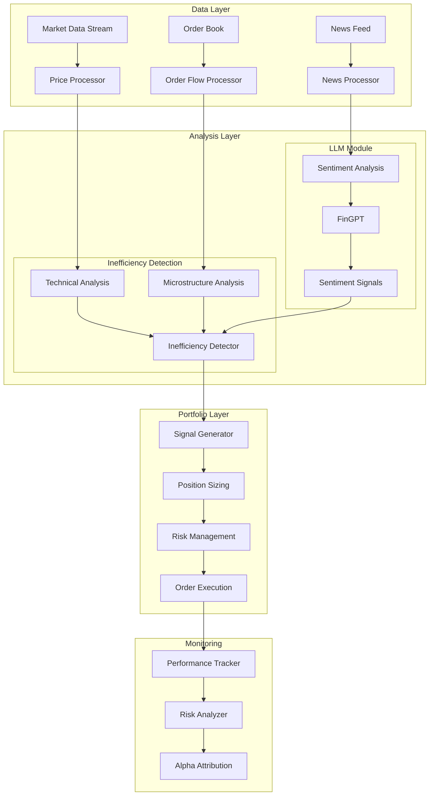

# FinGPT Market Inefficiency Trading System

A sophisticated trading system that combines Large Language Models (specifically FinGPT) with market inefficiency detection to identify and exploit market anomalies.

## Core Concepts & Theory

### Market Inefficiencies
Market inefficiencies occur when asset prices deviate from their fundamental values due to:
1. Behavioral biases (overreaction, herding)
2. Structural inefficiencies (liquidity constraints, rebalancing flows)
3. Information asymmetry (news impact, sentiment divergence)

## Market Inefficiencies & Mathematical Foundations

### 1. Price-Sentiment Divergence
When price movements diverge from sentiment, indicating potential overreaction:

```math
D(t) = [P(t) - P(t-1)]/P(t-1) - λS(t)

where:
- D(t): Divergence at time t
- P(t): Price at time t
- S(t): Sentiment score [-1,1]
- λ: Sentiment impact factor
```

### 2. Order Flow Imbalance
Measures buying/selling pressure through order book analysis:

```math
OFI(t) = Σ[V_b(i) - V_a(i)] / Σ[V_b(i) + V_a(i)]

where:
- V_b(i): Volume at bid level i
- V_a(i): Volume at ask level i
```

### 3. Microstructure Mean Reversion
Based on Ornstein-Uhlenbeck process:

```math
dX_t = θ(μ - X_t)dt + σdW_t

where:
- θ: Mean reversion rate
- μ: Long-term mean
- σ: Volatility
- W_t: Wiener process
```

### 4. Volume-Weighted Price Pressure
Measures price impact relative to normal volume:

```math
VWPP = Σ(V_i × |P_i - VWAP|) / (σ_p × V_avg)

where:
- V_i: Volume at price level i
- P_i: Price at level i
- VWAP: Volume-weighted average price
- σ_p: Price volatility
- V_avg: Average daily volume
```

### LLM-Enhanced Trading
We use FinGPT to:
- Parse and analyze financial news in real-time
- Detect market sentiment shifts
- Identify potential mispricing events
- Predict market reactions to events

## System Architecture



## Implementation Details

### 1. Market Data Processing
```python
from models.market.inefficiency import MarketInefficencyDetector

# Initialize detector
detector = MarketInefficencyDetector(config={
    'lookback_periods': {'short': 5, 'medium': 20, 'long': 60},
    'min_confidence': 0.65
})

# Detect inefficiencies
signals = detector.detect_inefficiencies(
    prices=price_data,
    volume=volume_data,
    sentiment=sentiment_scores
)
```

### 2. Sentiment Analysis
```python
from models.llm.fingpt import FinGPT
from models.sentiment.analyzer import SentimentAnalyzer

# Initialize sentiment analyzer
analyzer = SentimentAnalyzer({
    'model_name': 'FinGPT/fingpt-mt_falcon-7b',
    'batch_size': 16
})

# Analyze news
sentiment = await analyzer.analyze_text(news_headlines)
```

### 3. Portfolio Optimization
```python
from models.portfolio.optimization import PortfolioOptimizer

optimizer = PortfolioOptimizer({
    'risk_free_rate': 0.02,
    'constraints': {
        'min_weight': 0.0,
        'max_weight': 0.3,
        'min_positions': 5
    }
})

optimal_weights = optimizer.optimize(returns_data)
```

## Quantitative Components

### 1. Portfolio Optimization
Uses Black-Litterman model with sentiment integration:

```math
E[R] = [(τΣ)^{-1} + P'Ω^{-1}P]^{-1}[(τΣ)^{-1}π + P'Ω^{-1}Q]

where:
- E[R]: Expected returns
- τ: Uncertainty parameter
- Σ: Covariance matrix
- P: Pick matrix
- Ω: View uncertainty
- π: Market equilibrium returns
- Q: View returns (including sentiment)
```

### 2. Risk Management
Dynamic position sizing using modified Kelly Criterion:

```math
f* = (p × ln(1 + b) - (1-p) × ln(1 - a))/((a + b) × ln(1 + b) × ln(1 - a))

where:
- f*: Optimal fraction
- p: Win probability
- b: Win/loss ratio
- a: Risk of ruin threshold
```

### 3. Signal Generation
Composite signal scoring:

```math
S_composite = w_1S_sentiment + w_2S_technical + w_3S_microstructure

where:
S_i = tanh(β_i × raw_signal_i)
```

### 4. Dynamic Thresholding
Adaptive threshold based on market volatility:

```math
T(t) = T_base × (1 + γ × σ_t/σ_avg)

where:
- T_base: Base threshold
- γ: Volatility sensitivity
- σ_t: Current volatility
- σ_avg: Average volatility
```

## Robo Advisor System

### A. Portfolio Theory & Asset Allocation

#### 1. Risk Profiling
Client risk profiles are determined using:

```math
R_profile = w_1Q_1 + w_2Q_2 + w_3Q_3 + w_4Q_4

where:
- Q_1: Investment horizon score
- Q_2: Risk tolerance score
- Q_3: Income stability score
- Q_4: Investment experience score
```

#### 2. Strategic Asset Allocation
Uses Black-Litterman with ESG constraints:

```math
w* = argmax_w(w'μ - λw'Σw)
subject to:
- Σw_i = 1
- w_i ≥ 0
- ESG_score(w) ≥ threshold
- sector_exposure(w) ≤ limits
```

#### 3. Dynamic Rebalancing
Threshold rebalancing with tax considerations:

```math
Rebalance if: |w_current - w_target| > min(base_threshold, tax_adjusted_threshold)

where:
tax_adjusted_threshold = base_threshold × (1 + tax_impact_factor)
```

### B. Implementation Components

1. **Client Profiling**
```python
class ClientProfile:
    risk_score: float        # 1-10 scale
    investment_horizon: int   # years
    constraints: Dict        # Investment constraints
    tax_rate: float         # Marginal tax rate
    esg_preferences: Dict    # ESG scoring weights
```

2. **Portfolio Construction**
```python
class PortfolioConstructor:
    def construct_portfolio(self, profile: ClientProfile) -> Dict:
        # Strategic allocation
        base_weights = self.get_strategic_allocation(profile.risk_score)
        
        # Apply constraints
        constrained_weights = self.apply_constraints(
            weights=base_weights,
            constraints=profile.constraints,
            esg_scores=self.esg_data
        )
        
        # Tax-aware implementation
        implementation = self.generate_tax_aware_trades(
            target_weights=constrained_weights,
            current_portfolio=self.get_current_holdings(),
            tax_rate=profile.tax_rate
        )
        
        return implementation
```

3. **Rebalancing Logic**
```python
class RebalanceScheduler:
    def check_rebalance_needs(self, portfolio: Dict) -> bool:
        drift = self.calculate_portfolio_drift(portfolio)
        tax_impact = self.estimate_tax_impact(portfolio)
        
        # Adjust threshold based on tax impact
        threshold = self.base_threshold * (1 + self.tax_impact_factor * tax_impact)
        
        return drift > threshold
```

### C. Advanced Features

1. **Tax-Loss Harvesting**
```python
def harvest_tax_losses(portfolio: Dict, 
                      tax_rate: float,
                      wash_sale_window: int = 30) -> List[Trade]:
    """
    Identify tax-loss harvesting opportunities:
    - Find positions with unrealized losses
    - Calculate tax savings potential
    - Find suitable replacement securities
    - Check wash sale restrictions
    """
```

2. **ESG Integration**
```python
def optimize_esg_portfolio(weights: Dict[str, float],
                         esg_scores: Dict[str, float],
                         min_esg_score: float) -> Dict[str, float]:
    """
    Optimize portfolio while maintaining ESG constraints:
    - Calculate portfolio ESG score
    - Adjust weights to meet ESG minimum
    - Maintain risk-return efficiency
    """
```

3. **Smart Rebalancing**
```python
def smart_rebalance(portfolio: Dict,
                   target_weights: Dict[str, float],
                   tax_rate: float) -> List[Trade]:
    """
    Intelligent rebalancing that considers:
    - Tax implications
    - Trading costs
    - Tracking error
    - Cash flows
    """
```

### D. Risk Management

1. **Portfolio Risk Monitoring**
```math
TotalRisk = \sqrt{w'Σw + \sum_{i=1}^n \sum_{j=1}^n w_i w_j \rho_{ij} \sigma_i \sigma_j}

where:
- Σ: Covariance matrix
- ρ_{ij}: Correlation between assets i and j
- σ_i: Individual asset volatility
```

2. **Drawdown Control**
```python
def manage_drawdown(portfolio: Dict, 
                   max_drawdown: float,
                   current_drawdown: float) -> List[Action]:
    """
    Implement drawdown control:
    1. Monitor portfolio value vs high-water mark
    2. Adjust risk exposure when approaching limits
    3. Implement hedging if needed
    """
```

### E. Performance Reporting

```python
@dataclass
class PortfolioReport:
    returns: Dict[str, float]         # Period returns
    risk_metrics: Dict[str, float]    # Risk measures
    tax_impact: Dict[str, float]      # Tax analysis
    esg_metrics: Dict[str, float]     # ESG scores
    rebalance_needs: Dict[str, bool]  # Rebalancing flags
    recommendations: List[str]         # Action items
```

## Trading Strategy Implementation

### Signal Generation
1. **Market Inefficiency Detection**
   ```python
   class InefficencySignal:
       type: str        # Type of inefficiency
       confidence: float # Signal confidence [0-1]
       magnitude: float # Expected price impact
       horizon: str     # Time horizon
   ```

2. **Position Sizing**
   ```python
   def kelly_position_size(signal: InefficencySignal) -> float:
       win_prob = signal.confidence
       win_loss_ratio = abs(signal.magnitude)
       kelly_fraction = win_prob - (1-win_prob)/win_loss_ratio
       return min(kelly_fraction, max_position_size)
   ```

3. **Risk Management**
   ```python
   def calculate_portfolio_risk(positions, risk_metrics):
       portfolio_var = calculate_var(positions)
       if portfolio_var > max_var:
           scale_down_positions()
   ```

## Implementation Examples

### 1. Signal Generation
```python
def generate_composite_signal(data: Dict) -> float:
    # Sentiment component
    sentiment_score = calc_sentiment_score(data['news'])
    
    # Technical component
    tech_score = calc_technical_score(data['price'], data['volume'])
    
    # Microstructure component
    micro_score = calc_microstructure_score(data['orderbook'])
    
    # Combine signals using dynamic weights
    weights = calculate_adaptive_weights(data['market_state'])
    return np.dot([sentiment_score, tech_score, micro_score], weights)
```

### 2. Position Sizing
```python
def calculate_position_size(signal: float, 
                          volatility: float, 
                          capital: float) -> float:
    # Modified Kelly sizing with volatility adjustment
    kelly_fraction = calculate_kelly_fraction(
        win_prob=signal_to_probability(signal),
        win_loss_ratio=estimate_win_loss_ratio(volatility)
    )
    
    # Apply volatility scaling
    vol_scalar = target_vol / current_vol
    position = kelly_fraction * capital * vol_scalar
    
    return min(position, max_position_size)
```

## Configuration

### Sample Config
```yaml
model:
  base_model: "falcon-7b"
  peft_model: "FinGPT/fingpt-mt_falcon-7b_lora"
  batch_size: 16
  max_length: 512

trading:
  max_position_size: 0.2
  risk_limit: 0.05
  confidence_threshold: 0.65
  rebalance_threshold: 0.05

monitoring:
  track_metrics: ["sharpe", "sortino", "var"]
  log_level: "INFO"
  save_trades: true
```

## Example Usage

### 1. Initialize System
```python
from fingpt_trader import TradingSystem

system = TradingSystem(config_path="config/trading.yaml")
await system.initialize()
```

### 2. Run Strategy
```python
async def main():
    while True:
        # Get market data
        market_data = await system.get_market_data()
        
        # Analyze inefficiencies
        signals = system.detect_inefficiencies(market_data)
        
        # Generate trades
        trades = system.generate_trades(signals)
        
        # Execute and monitor
        await system.execute_trades(trades)
        system.update_risk_metrics()
```

## Performance Metrics

### Real-time Monitoring
- Sharpe Ratio
- Value at Risk (VaR)
- Maximum Drawdown
- Win Rate
- Profit Factor

### Sample Results
```python
{
    'sharpe_ratio': 2.5,
    'sortino_ratio': 3.1,
    'max_drawdown': -0.12,
    'win_rate': 0.62,
    'profit_factor': 1.8
}
```

## Installation & Setup

1. **Environment Setup**
   ```bash
   python -m venv venv
   source venv/bin/activate  # Linux/Mac
   pip install -r requirements.txt
   ```

2. **Configuration**
   ```bash
   cp config/example.yaml config/trading.yaml
   # Edit trading.yaml with your parameters
   ```

3. **Run System**
   ```bash
   python scripts/run_trader.py --config config/trading.yaml
   ```

## Project Structure
```
fingpt-trader/
│
├── data/
│   ├── raw/                # Raw market data, news feeds
│   ├── processed/          # Processed and engineered features
│   └── logs/              # System and performance logs
│
├── models/
│   ├── llm/
│   │   ├── base.py           # Base LLM interface
│   │   ├── fingpt.py         # FinGPT implementation
│   │   └── utils/
│   │       ├── tokenizer.py  # Tokenization utilities
│   │       └── inference.py  # Inference helpers
│   ├── sentiment/
│   │   ├── analyzer.py       # Sentiment analysis logic
│   │   └── preprocessor.py   # Text preprocessing
│   ├── market/
│   │   ├── inefficiency.py   # Market inefficiency detection
│   │   └── patterns.py       # Pattern recognition
│   └── portfolio/
│       ├── optimization.py   # Portfolio optimization
│       ├── risk.py          # Risk modeling
│       └── rebalancing.py   # Rebalancing logic
│
├── services/
│   ├── base_service.py    # Base service interface
│   ├── data_feeds/
│   │   ├── market_data_service.py  # Market data integration
│   │   └── news_service.py         # News aggregation service
│   ├── trading/
│   │   ├── broker_service.py       # Broker API integration
│   │   └── order_manager.py        # Order lifecycle management
│   │   └── robo_service.py         # Robo advisor service
│   └── monitoring/
│       ├── system_monitor.py       # System health tracking
│       └── performance_tracker.py   # Trading performance analytics
│
├── strategies/
│   ├── base_strategy.py   # Strategy interface
│   ├── sentiment/         # Sentiment-based strategies
│   ├── inefficiency/      # Market inefficiency strategies
│   ├── hybrid/           # Combined strategy implementations
│   └── robo/
│       ├── allocation.py      # Asset allocation strategies
│       ├── rebalancing.py     # Rebalancing strategies
│       └── tax_aware.py       # Tax-aware trading strategies
│
├── utils/
│   ├── config.py         # Configuration management
│   ├── logging.py        # Logging utilities
│   └── validation.py     # Data validation helpers
│
├── config/
│   ├── services.yaml     # Service configurations
│   ├── strategies.yaml   # Strategy parameters
│   └── logging.yaml      # Logging configuration
│
├── tests/
│   ├── services/         # Service unit tests
│   ├── strategies/       # Strategy unit tests
│   └── integration/      # Integration tests
│
├── scripts/
│   ├── backtest.py      # Backtesting framework
│   ├── live_trade.py    # Live trading entry point
│   └── analyze.py       # Performance analysis
│
├── requirements.txt
├── setup.py
├── LICENSE
└── README.md
```

## Contributing

Please read `CONTRIBUTING.md` for details on our code of conduct and the process for submitting pull requests.

## License

This project is licensed under the MIT License - see the `LICENSE.md` file for details.