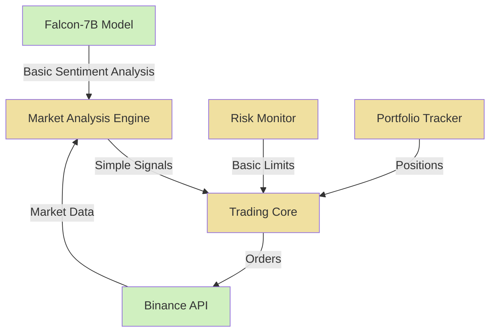

# FinGPT Trader

A quantitative trading system integrating a large language model (Falcon-7B) with market data analysis. The system uses natural language processing for market sentiment analysis alongside quantitative methods for trading decision support.

## Current Implementation Status

✅ = Implemented | 🚧 = Partially Implemented | 📅 = Planned

## System Components

- **Quantitative Analysis Engine**
  - 🚧 Basic market data processing
  - 📅 Order book imbalance analysis
  - 📅 Market microstructure modeling

- **Sentiment Analysis**
  - ✅ Basic sentiment extraction using Falcon-7B
  - 🚧 News impact integration
  - 📅 Advanced text-based signal generation

- **Trading Framework**
  - ✅ Event-driven architecture
  - ✅ Asynchronous execution
  - 📅 Multi-asset portfolio optimization

## Functional Features

### Currently Implemented ✅

- **Sentiment Analysis**
  - Real-time processing of news with Falcon-7B
  - Confidence-weighted sentiment scores
  - Integration with trading signals

- **Basic Market Data Processing**
  - Price data collection from Binance
  - Simple statistical analysis
  - Signal generation based on confidence thresholds

- **Trading Execution**
  - Binance testnet integration
  - Market order execution
  - Position management

- **Risk Monitoring**
  - Basic position tracking
  - Simple exposure metrics
  - Initial drawdown monitoring

### In Development 🚧

- **Market Analysis**
  - Improved sentiment integration with market data
  - Better minimum order size handling
  - Enhanced trade signal generation

- **System Stability**
  - Event loop management and graceful shutdown
  - Error recovery mechanisms
  - API rate limit handling

### Planned Features 📅

- **Advanced Portfolio Management**
  - Dynamic position sizing based on Kelly Criterion
  - Risk-adjusted rebalancing
  - Multi-asset correlation analysis

- **Tax Optimization**
  - Tax-loss harvesting algorithms
  - Wash sale prevention logic
  - Tax efficiency metrics

- **Advanced Risk Management**
  - Value-at-Risk (VaR) calculations
  - Sentiment-adjusted position sizing
  - Correlation-aware risk metrics

## System Architecture



## Quick Start

1. **Environment Setup**
```bash
# Create virtual environment
python -m venv venv
source venv/bin/activate  # or `venv\Scripts\activate` on Windows

# Install dependencies
pip install -r requirements.txt
```

2. **Configuration**
```bash
# Set up your .env file with required API keys:
BINANCE_API_KEY=your_key_here
BINANCE_API_SECRET=your_secret_here
CRYPTOPANIC_API_KEY=your_key_here  # Required for news feeds
HUGGINGFACE_TOKEN=your_token_here   # Optional for model access
```

3. **Run Trading System**
```bash
# Development mode (testnet)
python main.py
```

## Technical Implementation Details

### Sentiment Analysis Implementation

```python
# Current implementation of sentiment analysis
sentiment_result = await model.predict_sentiment(news_text)
sentiment_score = sentiment_result.get('sentiment', 0)
confidence = sentiment_result.get('confidence', 0.5)

# Signal generation with confidence threshold
if confidence >= config['confidence_threshold']:
    generate_trading_signal(sentiment_score, confidence)
```

### Current Challenges

The system currently faces several implementation challenges:

1. **Sentiment Analysis Quality**
   - Model produces inconsistent formatting
   - Confidence scoring needs improvement
   - News relevance filtering is basic

2. **Order Execution**
   - Minimum order size requirements not always met
   - Better USD to crypto quantity conversion needed
   - Improved error handling for rejected orders

3. **System Stability**
   - AsyncIO event loop management issues
   - Shutdown sequence optimization
   - Exception handling during data processing

## Roadmap: Planned Mathematical Framework

The following mathematical models are planned for future implementation:

### Sentiment-Adjusted Signal Model

$$ S(t) = \alpha M(t) + \beta I(t) + \gamma L(t) $$

Where:
- $S(t)$ is the final trading signal
- $M(t)$ is market microstructure score
- $I(t)$ is orderbook imbalance
- $L(t)$ is NLP sentiment score
- $\alpha, \beta, \gamma$ are weights

### Position Sizing with Kelly Criterion

$$ f^* = \frac{p(1+r) - q}{r} \cdot (1 + \lambda|S|) $$

### Advanced Risk Management

$$ VaR_{\alpha}(S) = -\inf\{l \in \mathbb{R}: P(L \leq l | S) \geq \alpha\} $$

$$ R = \sqrt{w^T\Sigma w} \cdot (1 + \delta|S|) $$

## Development Status

Current development priorities:
- [x] Fix AsyncIO event loop issues
- [x] Improve error handling in API calls
- [ ] Enhance sentiment analysis prompt engineering
- [ ] Fix minimum order size calculation
- [ ] Implement proper USD to crypto quantity conversion
- [ ] Develop basic backtesting framework

## Warning

⚠️ **IMPORTANT**: This system is in early development stage and not production-ready:
- Use testnet only - not suitable for real trading yet
- Expect instability and potential errors
- Many advanced features described are planned but not yet implemented
- System requires significant technical knowledge to run properly

## License

MIT License - See [LICENSE](LICENSE) for details.

## Contributing
See [CONTRIBUTING.md](CONTRIBUTING.md) for guidelines on contributing to this project.

## Acknowledgments

- [Falcon-7B](https://huggingface.co/tiiuae/falcon-7b) for NLP capabilities
- [python-binance](https://python-binance.readthedocs.io/) for exchange connectivity
- [FinRL](https://github.com/AI4Finance-Foundation/FinRL) for inspiration