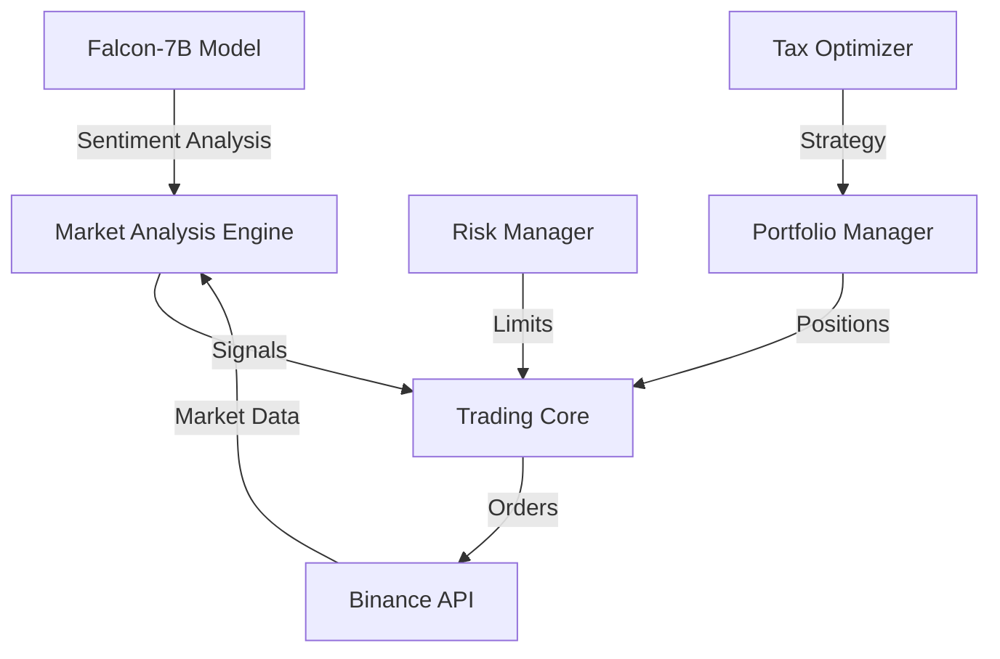

# FinGPT Trader 🔬📈

A quantitative trading system integrating large language models (Falcon-7B) with statistical arbitrage strategies. Combines natural language processing for market sentiment analysis with traditional quantitative methods for market inefficiency detection.

## System Overview

- **Quantitative Analysis Engine**
  - Statistical arbitrage detection
  - Order book imbalance analysis
  - Market microstructure modeling

- **NLP-Enhanced Market Analysis**
  - Sentiment extraction using Falcon-7B
  - News impact quantification
  - Text-based signal generation

- **Systematic Trading Framework**
  - Event-driven architecture
  - Asynchronous execution
  - Multi-asset portfolio optimization

## Core Features 🚀

- **AI-Driven Market Analysis**
  - Real-time sentiment analysis using Falcon-7B
  - Pattern recognition in order book data
  - Market inefficiency detection using ML

- **Smart Portfolio Management**
  - Dynamic position sizing based on Kelly Criterion
  - Tax-aware trading with loss harvesting
  - Risk-adjusted rebalancing

- **Multi-Exchange Support**
  - Binance integration (testnet/mainnet)
  - Advanced connection management
  - Rate limit handling

## System Architecture 🏗️



## Quick Start 🚦

1. **Environment Setup**
```bash
# Create virtual environment
python -m venv venv
source venv/bin/activate  # or `venv\Scripts\activate` on Windows

# Install dependencies
pip install -r requirements.txt
```

2. **Configuration**
```bash
# Set up your .env file
cp .env.example .env
# Edit with your API keys and tokens:
# - BINANCE_API_KEY
# - BINANCE_SECRET_KEY
# - HUGGINGFACE_TOKEN
```

3. **Run Trading System**
```bash
# Development mode (testnet)
python main.py

# With specific pairs
python scripts/run_trader.py --pairs BTCUSDT,ETHUSDT
```

## Unique Features 💫

### 1. AI-Enhanced Market Analysis
```python
# Example of sentiment-adjusted trading signal
sentiment_score = await analyzer.get_sentiment(news_data)
market_signal = detector.analyze_inefficiencies(
    orderbook_data=depth,
    sentiment_weight=sentiment_score
)
```

### 2. Advanced Risk Management
- Dynamic VaR calculation
- Sentiment-adjusted position sizing
- Real-time drawdown monitoring

### 3. Tax-Aware Trading
- Automated tax-loss harvesting
- Wash sale prevention
- Tax efficiency optimization

## Development Status 🔄

Currently in active development with focus on:
- [ ] WebSocket connection stability
- [ ] Enhanced error recovery
- [ ] Performance optimization
- [ ] Advanced backtesting framework

## Contributing 🤝

1. Fork the repository
2. Create your feature branch
3. Test thoroughly using testnet
4. Submit a pull request

## Trading Strategies 📊

Current implementation includes:
- Sentiment-driven market making
- Statistical arbitrage
- Tax-loss harvesting
- Portfolio rebalancing

## Warning ⚠️

This is a complex trading system. Always:
- Start with testnet trading
- Use small position sizes
- Monitor system performance
- Understand the risks involved

## License 📄

MIT License - See [LICENSE](LICENSE)

## Acknowledgments 🙏

- [Falcon-7B](https://huggingface.co/tiiuae/falcon-7b) for NLP capabilities
- [python-binance](https://python-binance.readthedocs.io/) for exchange connectivity
- [FinRL](https://github.com/AI4Finance-Foundation/FinRL) for inspiration