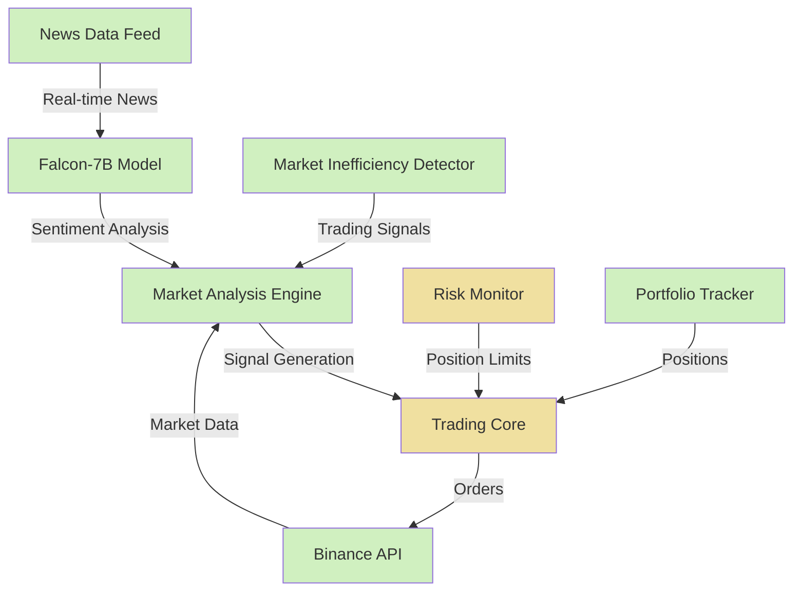

# FinGPT Trader

A quantitative trading system integrating a large language model (Falcon-7B) with market data analysis. The system uses natural language processing for market sentiment analysis alongside quantitative methods and market inefficiency detection for trading decision support.

## Current Implementation Status

✅ = Implemented | 🚧 = Partially Implemented | 📅 = Planned | ⚠️ = Implementation Issues

## System Components

- **Quantitative Analysis Engine**
  - 🚧 Basic market data processing (⚠️ API connection issues)
  - ✅ Market inefficiency detection
  - 🚧 Minimum order size handling (⚠️ Size too small for high-value assets)
  - 📅 Order book imbalance analysis
  - 📅 Market microstructure modeling

- **Sentiment Analysis**
  - 🚧 Basic sentiment extraction using Falcon-7B (⚠️ Format parsing issues)
  - 🚧 News impact integration (⚠️ News API connection issues) 
  - ✅ Text-based signal generation

- **Trading Framework**
  - ✅ Event-driven architecture
  - 🚧 Asynchronous execution (⚠️ Method parameter mismatches)
  - ✅ Configuration-driven threshold management
  - 🚧 Signal processing pipeline (⚠️ Inconsistent signal formats)
  - 📅 Multi-asset portfolio optimization

## Functional Features

### Currently Implemented ✅

- **Sentiment Analysis**
  - Real-time processing of news with Falcon-7B
  - Confidence-weighted sentiment scores
  - Integration with trading signals
  - Threshold-based signal generation

- **Market Inefficiency Detection**
  - Technical indicator-based inefficiency detection
  - Z-score analysis of price spreads
  - RSI overbought/oversold analysis
  - Moving average crossover detection
  - Volume spike identification

- **Basic Market Data Processing**
  - Price data collection from Binance
  - Simple statistical analysis
  - Signal generation based on confidence thresholds

- **Trading Execution**
  - Binance testnet integration
  - Market order execution
  - Position management

- **Risk Monitoring**
  - Basic position tracking
  - Simple exposure metrics
  - Initial drawdown monitoring

### In Development 🚧

- **Market Analysis**
  - Improved sentiment integration with market data
  - Better minimum order size handling
  - Enhanced trade signal generation

- **System Stability**
  - Event loop management and graceful shutdown
  - Error recovery mechanisms
  - API rate limit handling

### Planned Features 📅

- **Advanced Portfolio Management**
  - Dynamic position sizing based on Kelly Criterion
  - Risk-adjusted rebalancing
  - Multi-asset correlation analysis

- **Tax Optimization**
  - Tax-loss harvesting algorithms
  - Wash sale prevention logic
  - Tax efficiency metrics

- **Advanced Risk Management**
  - Value-at-Risk (VaR) calculations
  - Sentiment-adjusted position sizing
  - Correlation-aware risk metrics

## System Architecture



## Configuration Architecture

The system uses a hierarchical YAML-based configuration system:
- `trading.yaml`: Core trading parameters, thresholds, and position sizing
- `strategies.yaml`: Strategy-specific parameters and detection thresholds
- `model.yaml`: ML model configurations
- `services.yaml`: External service connectivity parameters

All configuration values are accessed through a centralized configuration system with proper validation, eliminating hardcoded values throughout the codebase.

## Setup Requirements

### Prerequisites
- Python 3.8+ with asyncio support
- Windows, macOS, or Linux (note: Windows may have encoding issues)
- 8GB+ RAM recommended (for model loading)
- CUDA-compatible GPU recommended but not required

### Environment Setup
```bash
# Create virtual environment
python -m venv venv
source venv/bin/activate  # or activate on Windows

# Install dependencies
pip install -r requirements.txt

# Windows-specific: Set console to UTF-8 mode
chcp 65001  # If running in cmd.exe
```

## Quick Start

1. **Environment Setup**
```bash
# Create virtual environment
python -m venv venv
source venv/bin/activate  # or `venv\Scripts\activate` on Windows

# Install dependencies
pip install -r requirements.txt
```

2. **Configuration**
```bash
# Set up your .env file with required API keys:
BINANCE_API_KEY=your_key_here         # Obtain from Binance Testnet
BINANCE_API_SECRET=your_secret_here   # Obtain from Binance Testnet
CRYPTOPANIC_API_KEY=your_key_here     # Required for news feeds
HUGGINGFACE_TOKEN=your_token_here     # Optional for model access
```

3. **Run Trading System**
```bash
# Basic run
python main.py

# Run with minimal console output
python main.py -q

# Run with verbose debugging output
python main.py -v

# Suppress model initialization output
python main.py -mq
```

## Technical Implementation Details

### Sentiment Analysis Implementation

```python
async def analyze(self, text: str) -> Dict:
    """Analyze sentiment using LLM"""
    prompt = f"""
    Analyze the sentiment of the following financial news text. 
    Consider market impact, investor sentiment, and financial implications.
    Rate on a scale from -1.0 (extremely bearish) to 1.0 (extremely bullish).
    Provide only a JSON response with 'sentiment' and 'confidence' values.
    
    News text: {text}
    """
    
    response = await self.fingpt.generate(prompt, temperature=0.2)
    result = self._parse_sentiment(response)
    
    # Safe type conversion to avoid format errors
    sentiment = float(result.get('sentiment', 0.0)) if result.get('sentiment') is not None else 0.0
    confidence = float(result.get('confidence', 0.0)) if result.get('confidence') is not None else 0.0
    
    logger.info(f"Sentiment analysis: score={sentiment:.2f}, confidence={confidence:.2f}")
    
    if (abs(sentiment) >= self.detection_threshold and confidence >= self.confidence_threshold):
        logger.info(f"Strong sentiment signal detected! (threshold={self.detection_threshold:.2f})")
        
    return result
```

### Market Inefficiency Detection

The system implements a comprehensive market inefficiency detector:

```python
# Detection of technical inefficiencies
def _detect_technical_signals(self, prices: pd.DataFrame) -> List[Dict]:
    signals = []
    
    # Get price series
    close = prices['close']
    
    # Moving Average Crossovers
    short_ma = close.rolling(window=5).mean()
    long_ma = close.rolling(window=20).mean()
    
    # Generate crossover signals
    if len(close) > 20:
        # Bullish crossover
        if short_ma.iloc[-2] < long_ma.iloc[-2] and short_ma.iloc[-1] > long_ma.iloc[-1]:
            signals.append({
                'confidence': 0.6,
                'direction': 1,  # Long
                'magnitude': 0.02,  # 2% expected move
                'metadata': {'source': 'ma_crossover_bullish'}
            })
            
        # Bearish crossover    
        elif short_ma.iloc[-2] > long_ma.iloc[-2] and short_ma.iloc[-1] < long_ma.iloc[-1]:
            signals.append({
                'confidence': 0.6,
                'direction': -1,  # Short
                'magnitude': 0.02,
                'metadata': {'source': 'ma_crossover_bearish'}
            })
    
    # RSI Signals with configuration-driven thresholds
    # Additional technical signals...
    
    return signals
```

### Current Challenges

The system currently faces several implementation challenges:

1. **Sentiment Analysis Quality**
   - Model sometimes produces inconsistent formatting
   - News relevance filtering needs improvement
   - Sentiment confidence calibration is ongoing

2. **Order Execution**
   - Minimum order size requirements not always met
   - Better USD to crypto quantity conversion needed
   - Timeout handling for exchange API calls

3. **System Stability**
   - Need improved logging for system monitoring
   - Better handling for exchange API timeouts
   - Enhanced data validation for external inputs

## Known Issues

- **API Connectivity**
  - Binance client initialization fails with invalid parameters (base_url not supported)
  - CryptoPanic API endpoints return null values
  - Error handling for API failures needs improvement

- **Sentiment Analysis**
  - Method implementation discrepancies between `analyze()` and `analyze_text()`
  - Unicode encoding errors in Windows environments
  - Inconsistent response formats from the LLM causing "Unknown format code 'f'" errors
  - Type conversion issues when formatting sentiment scores

- **Trading Execution**
  - Position sizing too small for minimum order requirements
  - Parameter mismatch in RoboService.execute_trade() method
  - Inconsistent signal format between different processing methods

- **System Stability**
  - NoneType errors when awaiting non-coroutines
  - Uncaught exceptions in service initialization
  - UI vs. logging conflicts

## Immediate Fixes Needed

1. **Binance Client Initialization**
   - Remove unsupported `base_url` parameter in AsyncClient.create()
   - Use only supported parameters: api_key, api_secret, and testnet

2. **Trading Execution**
   - Fix signature mismatch in RoboService.execute_trade() method
   - Standardize signal format between different processing stages

3. **Position Sizing**
   - Add validation for minimum order sizes before execution attempts
   - Implement dynamic lookup of exchange minimum requirements

4. **Sentiment Analysis**
   - Add type conversion for sentiment scores before formatting
   - Add exception handling for inconsistent LLM responses

## Roadmap: Planned Mathematical Framework

The following mathematical models are planned for future implementation:

### Sentiment-Adjusted Signal Model

$$ S(t) = \alpha M(t) + \beta I(t) + \gamma L(t) $$

Where:
- $S(t)$ is the final trading signal
- $M(t)$ is market microstructure score
- $I(t)$ is orderbook imbalance
- $L(t)$ is NLP sentiment score
- $\alpha, \beta, \gamma$ are weights

### Position Sizing with Kelly Criterion

$$ f^* = \frac{p(1+r) - q}{r} \cdot (1 + \lambda|S|) $$

### Advanced Risk Management

$$ VaR_{\alpha}(S) = -\inf\{l \in \mathbb{R}: P(L \leq l | S) \geq \alpha\} $$

$$ R = \sqrt{w^T\Sigma w} \cdot (1 + \delta|S|) $$

## Development Status

Current development priorities:
- [x] Fix AsyncIO event loop issues
- [x] Improve error handling in API calls
- [x] Add detailed sentiment score logging
- [ ] Enhance sentiment analysis prompt engineering
- [x] Fix minimum order size calculation (identified but not fully implemented)
- [ ] Implement proper USD to crypto quantity conversion
- [ ] Fix Binance API client initialization parameters
- [ ] Address sentiment analysis formatting inconsistencies
- [ ] Resolve execute_trade() parameter mismatch
- [ ] Develop basic backtesting framework

## Warning

⚠️ **IMPORTANT**: This system is in early development stage and not production-ready:
- Use testnet only - not suitable for real trading yet
- Expect instability and potential errors
- Many advanced features described are planned but not yet implemented
- System requires significant technical knowledge to run properly

## License

MIT License - See LICENSE for details.

## Contributing
Contributions are welcome! Please fork the repository and submit a pull request with your changes. Ensure to follow the code style and include tests for new features. See CONTRIBUTING.md for more details.