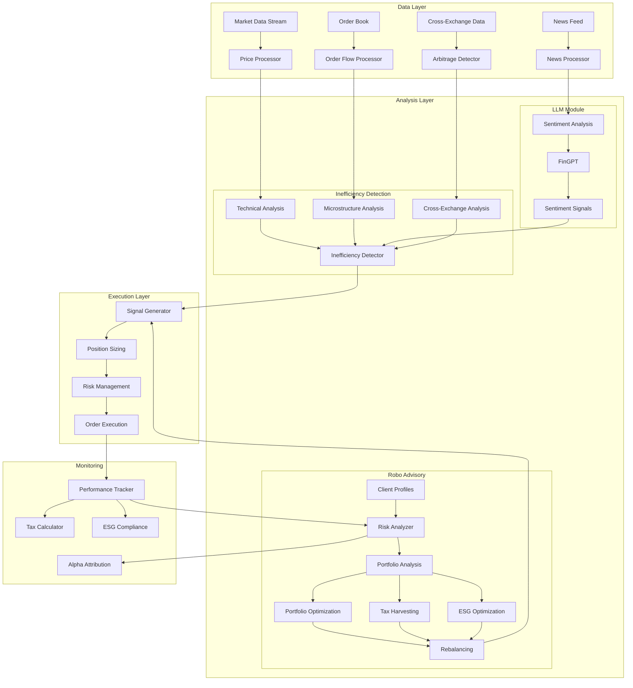

# FinGPT Market Inefficiency Trading System

An algorithmic crypto trading system combining FinGPT with market inefficiency detection and robo-advisory capabilities.

## Market Inefficiencies in Crypto Markets

Market inefficiencies represent deviations from the Efficient Market Hypothesis (EMH) where prices don't fully reflect all available information. In crypto markets, these inefficiencies are particularly pronounced due to:

### Information Asymmetry
```math
IA(t) = |P(t) - E[P(t)|Ω(t)]|
where:
- P(t): Observed price at time t
- Ω(t): Complete information set
- E[P(t)|Ω(t)]: Expected price given full information
```

Crypto markets often exhibit significant information gaps due to:
- Fragmented exchange landscapes
- Varying regulatory environments
- Complex technical foundations
- Rapid technological evolution

### Market Microstructure Inefficiencies
Common in crypto due to:
1. **Order Book Fragmentation**
   - Multiple exchanges
   - Varying liquidity pools
   - Cross-chain complexities

2. **Price Formation Dynamics**
   ```math
   P(t) = P(t-1) + λ(D(t) + η(t))
   where:
   - λ: Market impact parameter
   - D(t): Order flow imbalance
   - η(t): Noise trader impact
   ```

3. **Arbitrage Opportunities**
   - Cross-exchange pricing discrepancies
   - Cross-chain value transfers
   - Market maker inventory imbalances

### Why These Matter
1. **Alpha Generation**
   - Short-term price prediction
   - Statistical arbitrage opportunities
   - Mean reversion strategies

2. **Risk Management**
   - Liquidity risk assessment
   - Market impact estimation
   - Portfolio rebalancing costs

3. **Market Making**
   - Optimal spread determination
   - Inventory management
   - Cross-exchange arbitrage

## Trading Strategies

### 1. Sentiment-Driven Market Making
Exploits sentiment-price divergences in crypto markets:

```math
Signal_{sentiment} = \begin{cases}
    1, & \text{if } |S(t) - \beta P'(t)| > \theta \text{ and } S(t) > P'(t) \\
    -1, & \text{if } |S(t) - \beta P'(t)| > \theta \text{ and } S(t) < P'(t) \\
    0, & \text{otherwise}
\end{cases}

where:
- S(t): Normalized sentiment score
- P'(t): Price return
- β: Sentiment-price sensitivity
- θ: Divergence threshold
```

**Implementation Details:**
- Uses FinGPT for real-time sentiment analysis
- Monitors news, social media, and on-chain metrics
- Adapts β based on market volatility regime
- Dynamic θ threshold using market microstructure

### 2. Microstructure Alpha
Captures order flow imbalances and liquidity provision opportunities:

```math
OFI_{\alpha} = \sum_{i=1}^n w_i \cdot \frac{V_b^i - V_a^i}{V_b^i + V_a^i}

where:
- w_i: Level-specific weights
- V_b^i: Bid volume at level i
- V_a^i: Ask volume at level i
```

**Key Features:**
- Multi-level order book analysis
- Volume-weighted price impact estimation
- Adaptive order placement
- Cross-exchange liquidity aggregation

### 3. Statistical Arbitrage
Exploits temporary price dislocations:

```math
Z_{spread}(t) = \frac{P_1(t) - P_2(t) - \mu_{spread}}{\sigma_{spread}}

Trade when: |Z_{spread}| > Z_{threshold}
```

**Implementation:**
- Pairs trading across exchanges
- Cointegration-based pair selection
- Dynamic spread modeling
- Transaction cost optimization

### 4. Portfolio Management Strategies

#### a) Dynamic Asset Allocation
```math
w^*_t = argmax_w \{ w'\mu_t - \frac{\lambda}{2}w'\Sigma_t w \}
s.t. \begin{cases}
    w'1 = 1 \\
    w_i \geq 0 \\
    w_i \leq w_{max} \\
    ESG(w) \geq ESG_{min}
\end{cases}
```

#### b) Tax-Loss Harvesting
```math
Harvest_{value} = \sum_{i \in Losses} |P_i^{current} - P_i^{basis}| \cdot Q_i \cdot TaxRate
Execute \text{ if } Harvest_{value} > Costs_{transaction} + Costs_{opportunity}
```

#### c) Risk Parity Portfolio
```math
w_i \propto \frac{1}{\sigma_i} \text{ where } \sum w_i = 1
```

### Strategy Integration

1. **Signal Generation**
```python
combined_signal = w_1 * sentiment_signal + w_2 * micro_signal + w_3 * stat_arb_signal
where w_1 + w_2 + w_3 = 1
```

2. **Position Sizing**
```math
size = min(Kelly_{fraction} \cdot capital, position_{limit}, liquidity_{constraint})
where:
Kelly_{fraction} = p - \frac{1-p}{r}
```

3. **Risk Management**
- Per-trade stop loss
- Portfolio-level VaR limits
- Drawdown controls
- Exposure limits per strategy

4. **Execution Optimization**
- Smart order routing
- Transaction cost analysis
- Liquidity-aware execution
- Cross-exchange netting

## Core Components

### 1. Market Inefficiency Detection
We focus on four key types of market inefficiencies:

#### a) Sentiment-Price Divergence
When market sentiment and price movements show significant disparity:
```math
SPD(t) = |S(t) - P'(t)| > θ
where:
- S(t): Normalized sentiment score at time t
- P'(t): Normalized price change
- θ: Divergence threshold
```

#### b) Order Flow Imbalance
Detects unusual buying/selling pressure:
```math
OFI(t) = Σ[V_b(i) - V_a(i)] / Σ[V_b(i) + V_a(i)]
where:
- V_b(i): Volume at bid level i
- V_a(i): Volume at ask level i
```

#### c) Microstructure Mean Reversion
Based on mean-reverting behavior in market microstructure:
```math
MR(t) = -λ(P(t) - μ) + ε(t)
where:
- λ: Mean reversion rate
- μ: Long-term mean price
- ε(t): Random noise
```

#### d) Cross-Exchange Arbitrage
Identifies price discrepancies across exchanges:
```math
XA(t) = max(|P_i(t) - P_j(t)| - c_ij)
where:
- P_i(t): Price on exchange i
- P_j(t): Price on exchange j
- c_ij: Transaction costs
```

### 2. Robo Advisory System
Our robo advisor implements modern portfolio theory with ESG and tax considerations:

#### a) Portfolio Optimization
```math
w* = argmax_w(w'μ - λw'Σw)
subject to:
- Σw_i = 1
- w_i ≥ 0
- ESG_score(w) ≥ threshold
```

#### b) Tax-Loss Harvesting
```math
TaxSavings = Losses × TaxRate
Execute if: TaxSavings > TransactionCosts + OpportunityCost
```

#### c) Dynamic Rebalancing
```math
Rebalance if: |w_current - w_target| > min(base_threshold, tax_adjusted_threshold)
where: tax_adjusted_threshold = base_threshold × (1 + tax_impact_factor)
```

## System Architecture



### Architecture Components

#### 1. Data Layer
The foundation of our system, responsible for gathering and preprocessing all necessary data:

- **Market Data Stream [MD]**
  - Real-time cryptocurrency price feeds
  - Order book depth data
  - Trade execution data
  - Volume profiles

- **News Feed [NF]**
  - Cryptocurrency news articles
  - Social media sentiment
  - On-chain metrics
  - Market announcements

- **Order Book [OB]**
  - Level 2 market data
  - Bid-ask spreads
  - Liquidity depth analysis
  - Order flow imbalance

- **Cross-Exchange Data [XE]**
  - Price disparities
  - Liquidity differences
  - Arbitrage opportunities
  - Exchange-specific features

#### 2. Analysis Layer
Processes raw data into actionable insights:

- **Technical Analysis [TA]**
  - Price pattern recognition
  - Trend analysis
  - Volume profiling
  - Momentum indicators

- **Sentiment Analysis [SA]**
  - News sentiment scoring
  - Social media sentiment
  - Market sentiment indicators
  - Trend sentiment correlation

- **Microstructure Analysis [MA]**
  - Order flow analysis
  - Market impact estimation
  - Liquidity analysis
  - Tick data analysis

- **LLM Module**
  - Natural language processing
  - Context-aware analysis
  - Multi-source integration
  - Adaptive learning

#### 3. Inefficiency Detection
Identifies trading opportunities through:

- **Signal Generation**
  - Sentiment-price divergence
  - Order flow imbalance
  - Microstructure patterns
  - Cross-exchange arbitrage

- **Opportunity Scoring**
  - Confidence metrics
  - Execution probability
  - Risk-adjusted returns
  - Transaction costs

#### 4. Robo Advisory
Manages portfolio optimization and client requirements:

- **Risk Assessment [RA]**
  - Client risk profiling
  - Market risk analysis
  - Portfolio risk metrics
  - Drawdown management

- **Portfolio Analysis [PA]**
  - Asset allocation
  - Portfolio optimization
  - Performance attribution
  - Rebalancing needs

- **Tax & ESG**
  - Tax-loss harvesting
  - ESG scoring
  - Impact investing
  - Compliance monitoring

#### 5. Execution Layer
Handles trade execution and position management:

- **Position Sizing [PS]**
  - Kelly criterion optimization
  - Risk-based sizing
  - Portfolio constraints
  - Liquidity considerations

- **Risk Management [RM]**
  - Position limits
  - Stop-loss management
  - Exposure monitoring
  - VaR calculations

- **Order Execution [OE]**
  - Smart order routing
  - Transaction cost analysis
  - Execution algorithms
  - Post-trade analysis

#### 6. Monitoring
Tracks system performance and risk:

- **Performance Tracking [PT]**
  - Return metrics
  - Risk metrics
  - Attribution analysis
  - Benchmark comparison

- **Risk Analysis [RA]**
  - Real-time risk monitoring
  - Stress testing
  - Scenario analysis
  - Limit monitoring

- **Compliance [TC/EC]**
  - Tax efficiency monitoring
  - ESG compliance
  - Regulatory requirements
  - Trading restrictions

### Data Flow
1. Raw data enters through the Data Layer
2. Analysis Layer processes and enriches data
3. Inefficiency Detection identifies opportunities
4. Robo Advisory manages portfolio requirements
5. Execution Layer implements trading decisions
6. Monitoring Layer tracks performance and risk

## Project Structure
```
fingpt_trader/
├── main.py                 # Main trading system
├── models/
│   ├── llm/               # LLM-related models
│   │   ├── base.py        # Base LLM interface
│   │   ├── fingpt.py      # FinGPT implementation
│   │   └── utils/
│   │       ├── tokenizer.py
│   │       └── inference.py
│   ├── market/            # Market analysis
│   │   ├── inefficiency.py
│   │   └── patterns.py
│   ├── portfolio/         # Portfolio management
│   │   ├── optimization.py
│   │   ├── risk.py
│   │   └── rebalancing.py
│   └── sentiment/
│       ├── analyzer.py    # Sentiment analysis
│       └── preprocessor.py
├── services/
│   ├── base_service.py    # Base service interface
│   ├── data_feeds/        # Market data services
│   │   ├── market_data_service.py
│   │   └── news_service.py
│   ├── monitoring/        # System monitoring
│   │   ├── system_monitor.py
│   │   └── performance_tracker.py
│   └── trading/          # Trading services
│       ├── robo_service.py
│       └── order_manager.py
├── data/                  # Data storage
│   ├── raw/              # Raw market data
│   ├── processed/        # Processed features
│   └── logs/             # System logs
├── config/               # Configuration files
│   ├── trading.yaml     # Main trading config
│   ├── test_trading.yaml # Test config
│   └── logging.yaml     # Logging config
├── scripts/             # Utility scripts
│   ├── backtest.py
│   ├── analyze.py
│   ├── live_trade.py
│   └── run_trader.py
├── examples/            # Example implementations
│   ├── market_data.py
│   ├── sentiment_analysis.py
│   ├── pair_trading.py
│   └── robo_advisor_demo.py
├── utils/              # Utility functions
│   ├── config.py      # Configuration management
│   ├── logging.py     # Logging utilities
│   └── validation.py  # Data validation
└── tests/             # Test suite
    ├── test_system_integration.py
    ├── test_portfolio_optimization.py
    ├── test_signal_generation.py
    └── test_robo_advisor.py
```

## Mathematical Foundations

### 1. Market Inefficiency Detection
```math
D(t) = [P(t) - P(t-1)]/P(t-1) - λS(t)
OFI(t) = Σ[V_b(i) - V_a(i)] / Σ[V_b(i) + V_a(i)]
```

### 2. Portfolio Optimization
```math
E[R] = [(τΣ)^{-1} + P'Ω^{-1}P]^{-1}[(τΣ)^{-1}π + P'Ω^{-1}Q]
```

### 3. Risk Management
```math
VaR_α = -inf{x ∈ ℝ: P(X ≤ x) > α}
Kelly = (p × ln(1 + b) - (1-p) × ln(1 - a))/((a + b) × ln(1 + b) × ln(1 - a))
```

## Implementation Examples

### 1. System Initialization
```python
system = TradingSystem(config_path="config/trading.yaml")
await system.initialize()
```

### 2. Client Portfolio Management
```python
# Register client
await system.register_client("client1", {
    "risk_score": 7.0,
    "investment_horizon": 10,
    "constraints": {"max_stock": 0.8},
    "tax_rate": 0.25,
    "esg_preferences": {"min_score": 0.7}
})

# Get recommendation
portfolio = await system.get_portfolio_recommendation("client1")
```

### 3. Trading Execution
```python
# Market data analysis
market_data = await system.get_market_data()
signals = await system.detect_inefficiencies(market_data)

# Generate and execute trades
trades = system.generate_trades(signals)
await system.execute_trades(trades)
```

## Configuration

### Sample Trading Configuration
```yaml
trading:
  max_position_size: 0.2
  risk_limit: 0.05
  confidence_threshold: 0.65

robo:
  rebalance_threshold: 0.05
  tax_impact_factor: 0.3
  base_threshold: 0.02
```

## Installation

```bash
# Clone repository
git clone https://github.com/ashioyajotham/fingpt_trader.git
cd fingpt_trader

# Create virtual environment
python -m venv venv
source venv/bin/activate  # Linux/Mac
.\venv\Scripts\activate   # Windows

# Install dependencies
pip install -r requirements.txt

# Run tests
pytest tests/

# Start trading
python scripts/run_trader.py --config config/trading.yaml
```

## Contributing

See [CONTRIBUTING.md](CONTRIBUTING.md) for contribution guidelines.

## License

This project is licensed under the MIT License - see [LICENSE](LICENSE) file for details.