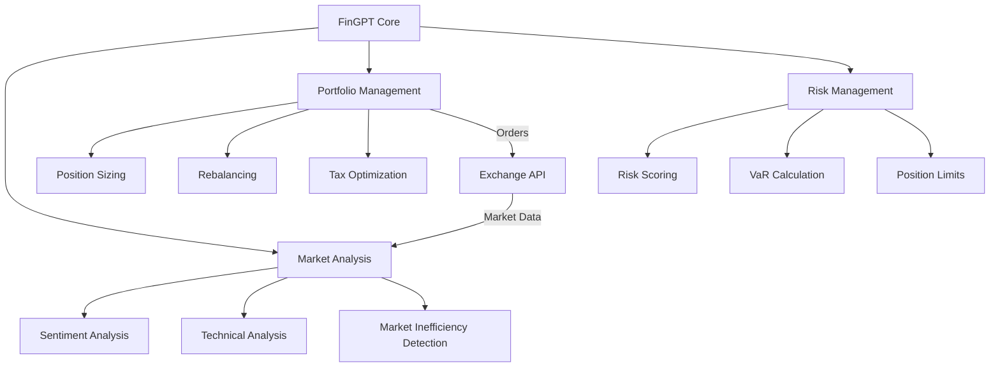

# FinGPT Trader

A quantitative trading system combining NLP-driven market sentiment analysis with statistical arbitrage detection and robo-advisory services.

## System Architecture



## Mathematical Foundation

### Portfolio Optimization

Our portfolio optimization uses a modified Markowitz model with sentiment factors:

$$ \max_w \{ w^T\mu - \lambda w^T\Sigma w + \gamma w^T S \} $$

Where:
- $w$ = portfolio weights
- $\mu$ = expected returns
- $\Sigma$ = covariance matrix
- $S$ = sentiment score matrix
- $\lambda$ = risk aversion parameter
- $\gamma$ = sentiment sensitivity parameter

### Risk Management

Value at Risk (VaR) calculation using GPT-enhanced historical simulation:

$$ VaR_\alpha = -\inf\{l \in \mathbb{R}: P(L \leq l) \geq \alpha\} $$

Combined with sentiment-adjusted position sizing:

$$ Position Size = \frac{Risk Capital \times Risk Score}{VaR_\alpha \times (1 + \|Sentiment Score\|)} $$

## Components

### 1. RoboService
- Core trading logic orchestration
- Client profile management
- Portfolio rebalancing

### 2. Exchange Clients
- Binance integration (with testnet support)
- Websocket market data streams
- Order execution

### 3. Market Analysis
- Sentiment analysis using GPT
- Technical indicator calculation
- Market inefficiency detection

### 4. Risk Management
- Position sizing
- Risk scoring
- Exposure limits

## Usage

### Production Deployment

## Quick Start

1. Install dependencies:
```bash
pip install -r requirements.txt
```

2. Configure your settings in `config.yaml`:
```yaml
exchange:
  name: binance
  test_mode: true
  api_key: your_api_key
  api_secret: your_api_secret

client_profile:
  risk_score: 5
  investment_horizon: 365
  tax_rate: 0.25

portfolio:
  initial_capital: 100000
  max_position_size: 0.1
  rebalancing_interval: 86400
```

3. Run the trader:
```bash
python run_trader.py
```

## Testing

Run backtests with historical data:
```bash
python scripts/backtest.py --config config.yaml --start 2023-01-01 --end 2023-12-31
```

## Implementation Details

### Market Data Processing
```python
async def get_market_data(symbol: str) -> Dict:
    [orderbook, trades, klines] = await asyncio.gather(
        self.get_orderbook(symbol),
        self.get_recent_trades(symbol),
        self.get_candles(symbol)
    )
    return {
        'orderbook': orderbook,
        'trades': trades,
        'candles': klines,
        'timestamp': datetime.now().timestamp()
    }
```

### Risk Calculation
Risk scoring combines traditional metrics with GPT sentiment:
```python
def calculate_risk_score(self, 
                        volatility: float,
                        sentiment: float,
                        market_impact: float) -> float:
    return (volatility * 0.4 + 
            abs(sentiment) * 0.3 + 
            market_impact * 0.3)
```

## Contributing
 
Follow the steps as outlined in [CONTRIBUTING.md](CONTRIBUTING.md)

## License

MIT License - see [LICENSE](LICENSE) for more details